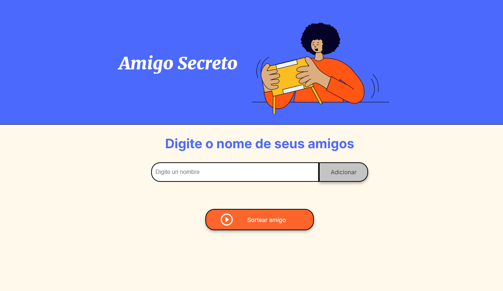

# Oracle Next Education

> **A tecnologia é para todos**
>
> O ONE é um programa de educação e empregabilidade com objetivo social de capacitar pessoas em tecnologia e conectá-las com o mercado de trabalho por meio de empresas parceiras.
>
> O curso é 100% online e totalmente gratuito, feito para quem não teve acesso à educação de qualidade e deseja transformar a sua realidade social.
>
> Esta formação faz parte do programa ONE, parceria de Alura + Oracle
>
> Saiba mais em https://www.oracle.com/br/education/oracle-next-education/

## Conhecendo a Formação

Se você não conhece nada de programação e desenvolvimento de software, mas deseja entrar nessa área onde o mercado de trabalho está superaquecido, a formação Iniciante em programação é para você!

Você vai criar suas primeiras páginas web, utilizando HTML, CSS, JS e assim aprender lógica de programação junto com as linguagens de programação mais utilizadas no mundo.

Se você trabalha em outras áreas como marketing digital, experiência do usuário (UX), design, ou áreas correlatas, essa formação te ajudará a entender melhor como a área de tecnologia funciona e, assim, você consegue se comunicar melhor com a área de desenvolvimento.

### Pessoas Envolvidas

## Lógica de Programação

### Aprenda lógica de programação

O raciocínio lógico nos acompanha o tempo todo. Por exemplo, para fazer café, precisamos primeiro aquecer a água, depois despejarmos ela quente sobre o pó de café, assim o pó será coado e o café estará pronto para beber. Caso não siga sequência lógica, vai ser difícil saborear um bom café.

A lógica de programação nada mais é do que uma sequência de passos para resolver um problema. Quem vai resolver o problema, nesse caso, é o computador, baseado nas instruções que passamos para ele. Então, precisamos saber quais tipos de instruções o computador entende e qual a melhor forma de passarmos os comandos para nos comunicarmos com ele.

### Ganhe experiência com Git

É muito importante se preparar para trabalhar em equipe na área de desenvolvimento, afinal, ninguém trabalha só. Então vamos aprender sobre o sistema de versionamento de código mais utilizado do mundo, o Github, que nos permite compartilhar código com outras pessoas de forma simples e segura.

Realizar um bom trabalho em equipe passa por ter um controle de versão de código, assim podemos recuperar, revisar, aprimorar, cada vez mais. Conhecer um sistema de controle de versão como o Git é essencial para manter a qualidade e a produtividade do trabalho.

### Encara o Challenge de Iniciante em Programação

#### O que são os Challenges Alura?

São uma metodologia baseada no Challenge-Based Learning, uma abordagem de aprendizagem baseada em desafios desenvolvida pela Apple. O Desafio Amigo Secreto é um passo importante para o sucesso no programa ONE. Por meio da prática e do aperfeiçoamento da lógica de programação, você poderá consolidar seus conhecimentos, dominar o pensamento lógico, aprimorar suas habilidades de análise e resolução de problemas, além de ampliar sua perspectiva no mundo do desenvolvimento.

Mãos na massa!

#### Challenge Amigo Secreto

O objetivo principal deste desafio é desenvolver habilidades em lógica de programação, por isso fornecemos o HTML e CSS já preparados. Dessa forma, você pode se concentrar exclusivamente em construir a lógica do código JavaScript, aplicando conceitos-chave como funções, arrays, condicionais e variáveis. Isso permitirá que você foque em resolver o problema e melhore o raciocínio lógico, sem se preocupar com a estrutura visual do projeto.

Funcionalidades:

- Adicionar nomes: Os usuários escreverão o nome de um amigo em um campo de texto e o adicionarão a uma lista visível ao clicar em "Adicionar".
- Validar entrada: Se o campo de texto estiver vazio, o programa exibirá um alerta solicitando um nome válido.
- Visualizar a lista: Os nomes inseridos aparecerão em uma lista abaixo do campo de entrada.
- Sorteio aleatório: Ao clicar no botão "Sortear Amigo", um nome da lista será selecionado aleatoriamente e exibido na página.
- Limpar Resultado (adicional): A ação de adicionar mais nomes na lista visível apaga o resultado do sorteio anterior.

## Licença

Este repositório possui o propósito de compartilhar o conhecimento adquirido, portanto, o conteúdo aqui disposto é de propriedade das empresas [Alura](https://www.alura.com.br/) e [Oracle](https://www.oracle.com/), conforme disponibilizados pelo programa [One](https://www.oracle.com/br/education/oracle-next-education/).
